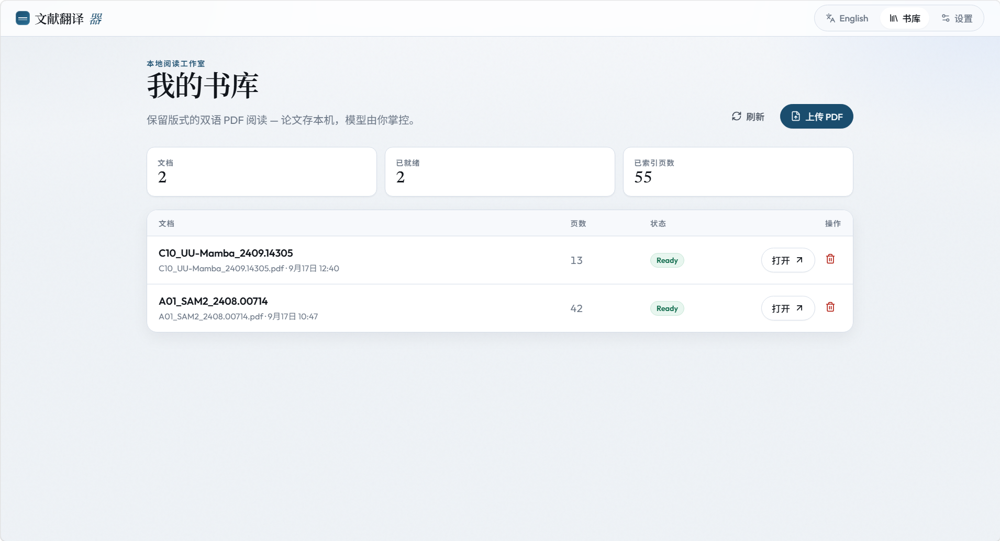
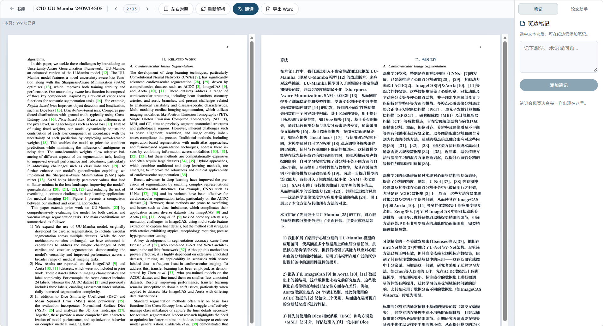
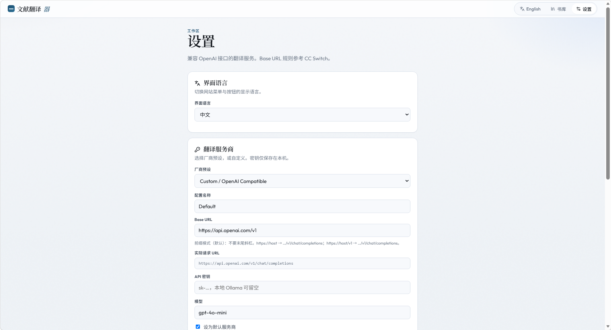
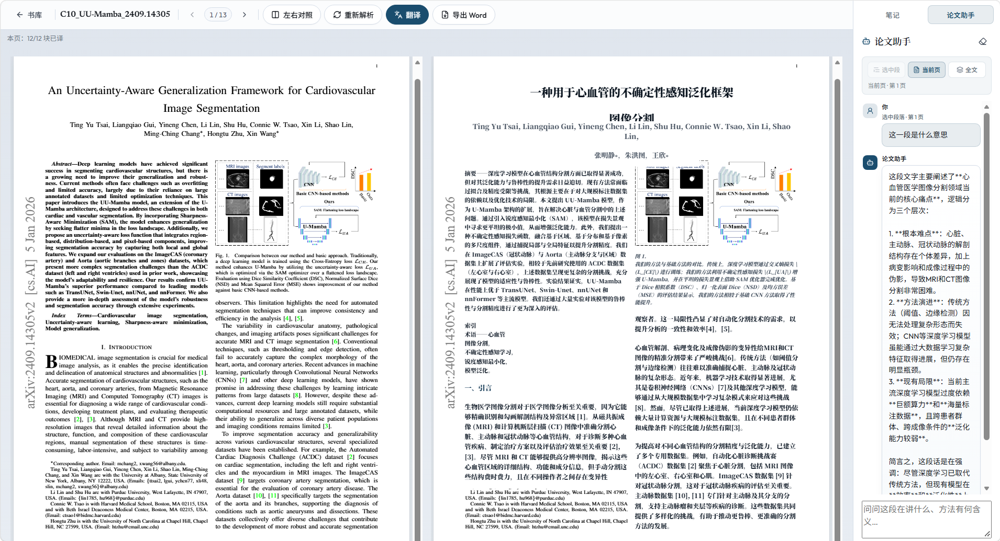

# Literature Translator

**Read foreign papers in your language — without losing the page.**

A local-first bilingual PDF reader for researchers, graduate students, and anyone who needs to *understand* academic literature, not just machine-translate it. Upload a paper, keep the original layout, read paragraph-level translations beside the source, annotate as you go, and ask a paper-aware assistant when a method section gets dense.

**Repository:** [github.com/chuqing-web/Literature-Translator](https://github.com/chuqing-web/Literature-Translator) · [Issues](https://github.com/chuqing-web/Literature-Translator/issues) · License [Apache-2.0](./LICENSE)

[English](./README.md) · [中文](./README.zh-CN.md)

```bash
git clone https://github.com/chuqing-web/Literature-Translator.git
cd Literature-Translator
```

---

## Screenshots

### Local library

Upload papers, track ready status, and open any document from your on-disk library.



### Side-by-side bilingual reading

Original PDF on the left, layout-aligned Chinese translation on the right, with margin notes and Paper Assistant in the rail.



### Provider settings

Connect any OpenAI-compatible endpoint: presets, Base URL, model, API key, live URL preview, and a connection test before you translate.



### Paper Assistant

Ask questions grounded in the selected passage, the current page, or the full document — one continuous thread per paper, next to your notes.



---

## Why this exists

Academic PDFs are hostile to translation tools.

Generic translators flatten pages into a wall of text. Figures drift. Equations vanish. Captions stick to the wrong paragraph. You lose the visual map that makes a paper readable — the columns, the callouts, the relationship between a claim and the figure that supports it.

Literature Translator is built for **layout-preserving bilingual reading**:

1. **Parse** the PDF into ordered text blocks with bounding boxes  
2. **Translate** those blocks with any OpenAI-compatible model you choose  
3. **Render** the original page with pdf.js, then place translations where the source lives — embedded under each block, or on a synchronized side-by-side pane  

Your papers stay on disk. Your API keys stay on your machine. The reading studio runs on `localhost`.

---

## Who it’s for

| You are… | You get… |
|----------|----------|
| A researcher skimming non-native papers | Faster comprehension without sacrificing layout |
| A grad student building a reading list | A local library of translated, annotated PDFs |
| A bilingual lab / reading group | Shared workflow: translate → note → discuss |
| Someone who cares about data locality | No cloud account, no upload-to-vendor-by-default |

---

## What you can do

### Layout-aware bilingual reading

- **Embedded mode** — Chinese (or your target language) appears under each source block on the page, with typography you control  
- **Side-by-side mode** — original PDF on the left, translation page on the right; same page size, aligned blocks, synchronized scroll  
- **Block-level edits** — fix a mistranslated sentence; edits persist locally  

Figures and formula-like regions stay as visuals from the PDF. Captions are treated as their own blocks so they can be translated without tearing the page apart.

### Local paper library

- Upload text-based PDFs into a personal library  
- Track parse / translate status per document  
- Reopen last reading position and keep working  

### Highlights, notes & paper assistant

- Highlight source blocks without breaking overlay layout  
- Anchor **margin notes** to a selected block or page  
- Chat with a **Paper Assistant** grounded in the selected passage, the current page, or (optionally) the full document — one continuous thread per paper  

### Your models, your keys

- Connect any **OpenAI-compatible** endpoint (cloud APIs, local gateways, Ollama-style setups)  
- Multiple provider profiles, vendor presets, and a live URL preview  
- Keys encrypted at rest on your machine — never shipped as part of a shared cloud account  

### Export when you need it

- Export bilingual content to **Word (.docx)** for drafting, sharing, or further editing  

---

## How it works

```
Browser (Vue 3 + pdf.js)
        │  REST
        ▼
FastAPI on localhost:8787
        ├── SQLite  (documents, blocks, translations, notes, highlights, assistant)
        ├── data/library/{doc_id}.pdf
        └── OpenAI-compatible chat API (translation + assistant)
```

1. **Upload** a PDF → stored under `data/library/`  
2. **Parse** with PyMuPDF → ordered text blocks + bounding boxes in SQLite  
3. **Translate** block-by-block via your configured provider  
4. **Read** with pdf.js overlays (embedded) or a mirrored translation pane (side-by-side)  
5. **Annotate** with notes / highlights; **ask** the Paper Assistant with scoped context  

---

## Feature highlights

| Capability | Detail |
|------------|--------|
| Bilingual reader | Embedded + side-by-side, layout-aligned |
| Translation | OpenAI-compatible providers; per-block progress & retry |
| Paper Assistant | Context: selected block → page → full document |
| Library | Local list, status, open / delete |
| Notes & highlights | Anchored to blocks / pages |
| Typography | Font family, size, line height for translations |
| i18n UI | Chinese / English interface |
| Privacy | Localhost + on-disk data; keys stay local |
| Export | Word (.docx) bilingual export |

---

## Requirements

| Dependency | Version | Purpose |
|------------|---------|---------|
| OS | Windows 10/11 recommended | One-click `scripts/start.ps1`; macOS/Linux work via manual steps |
| Git | 2.x | Clone the repository |
| Python | **3.11+** (3.11 or 3.12 preferred) | FastAPI backend |
| Node.js | **18+** (20 LTS recommended) | Vite + Vue frontend |
| npm | Comes with Node.js | Frontend dependencies |
| PDF input | Text-based (selectable) academic PDF | Scanned/image-only PDFs are unsupported (no OCR yet) |
| AI endpoint | Any **OpenAI-compatible** Chat Completions API | Translation + Paper Assistant (cloud or local, e.g. Ollama gateway) |

Optional: a local model server if you do not want a cloud API key.

---

## Deploy from zero (detailed)

Follow this section if you have never run the project on this machine. Commands assume the repository root is:

`C:\Projects\Literature-Translator`

Adjust the path if yours differs. On macOS/Linux, use the equivalent shell commands (venv activate path differs).

### Step 0 — Install system tools

#### 0.1 Git

1. Download Git for Windows: https://git-scm.com/download/win  
2. Install with defaults.  
3. Verify:

```powershell
git --version
```

#### 0.2 Python 3.11+

1. Download Python 3.11 or 3.12 from https://www.python.org/downloads/  
2. **Important:** during setup, check **“Add python.exe to PATH”**.  
3. Verify (either command is fine):

```powershell
python --version
# or
py -3.11 --version
```

You want `Python 3.11.x` or `3.12.x`. If `python` points to the Microsoft Store stub, use `py -3.11` in the steps below.

#### 0.3 Node.js 18+

1. Download the **LTS** installer from https://nodejs.org/  
2. Install with defaults (includes npm).  
3. Verify:

```powershell
node --version
npm --version
```

### Step 1 — Get the source code

If you already have the folder, skip to Step 2.

```powershell
cd C:\Projects
git clone https://github.com/chuqing-web/Literature-Translator.git
cd Literature-Translator
```

Or unzip a release archive into `C:\Projects\Literature-Translator` and `cd` into it.

Confirm the tree looks like:

```text
Literature-Translator/
├── apps/
│   ├── api/
│   └── web/
├── scripts/
│   └── start.ps1
├── picture/
├── README.md
└── README.zh-CN.md
```

### Step 2 — Create the data directory (first run)

Runtime files are written under `data/` (gitignored). Create it once if missing:

```powershell
cd "C:\Projects\Literature-Translator"
New-Item -ItemType Directory -Force -Path .\data\library | Out-Null
```

On first API start the app will also create `data/lit.db` and a local key file automatically.

### Step 3 — Backend: virtualenv + Python packages

```powershell
cd "C:\Projects\Literature-Translator\apps\api"

# Create venv (prefer 3.11)
py -3.11 -m venv .venv
# If that fails, try:
# python -m venv .venv

.\.venv\Scripts\python.exe -m pip install --upgrade pip
.\.venv\Scripts\pip.exe install -r requirements.txt
```

Verify uvicorn is available:

```powershell
.\.venv\Scripts\uvicorn.exe --version
```

### Step 4 — Frontend: npm packages

```powershell
cd "C:\Projects\Literature-Translator\apps\web"
npm install
```

### Step 5 — Start the services

#### Option A — One-click (Windows, recommended)

From the **repository root**:

```powershell
cd "C:\Projects\Literature-Translator"
.\scripts\start.ps1
```

If PowerShell blocks scripts:

```powershell
Set-ExecutionPolicy -Scope CurrentUser RemoteSigned
```

Then re-run `.\scripts\start.ps1`.

What the script does:

1. Creates `apps/api/.venv` and installs `requirements.txt` if missing  
2. Runs `npm install` in `apps/web` if `node_modules` is missing  
3. Starts API on **http://127.0.0.1:8787**  
4. Starts Vite on **http://127.0.0.1:5173**  
5. Opens the browser to the app  

**Default behavior:** closing the browser tab stops API + frontend (heartbeat / leave beacon).

To keep servers running without a browser tab:

```powershell
$env:LT_AUTO_SHUTDOWN = "0"
.\scripts\start.ps1
```

#### Option B — Manual start (two terminals)

**Terminal 1 — API**

```powershell
cd "C:\Projects\Literature-Translator\apps\api"
$env:LT_AUTO_SHUTDOWN = "0"
.\.venv\Scripts\uvicorn.exe app.main:app --host 127.0.0.1 --port 8787
```

Health check (another window):

```powershell
curl.exe http://127.0.0.1:8787/api/health
```

Expected JSON includes `"status":"ok"`.

**Terminal 2 — Web**

```powershell
cd "C:\Projects\Literature-Translator\apps\web"
npm run dev -- --host 127.0.0.1 --port 5173
```

Open **http://127.0.0.1:5173/** in the browser.

#### macOS / Linux (manual)

```bash
# Backend
cd apps/api
python3.11 -m venv .venv
source .venv/bin/activate
pip install -r requirements.txt
LT_AUTO_SHUTDOWN=0 uvicorn app.main:app --host 127.0.0.1 --port 8787

# Frontend (second terminal)
cd apps/web
npm install
npm run dev -- --host 127.0.0.1 --port 5173
```

### Step 6 — First-time configuration in the UI

1. Open http://127.0.0.1:5173/  
2. Go to **Settings**  
3. Add a provider:
   - Pick a vendor preset **or** enter a custom Base URL  
   - Enter **model** name and **API key** (for local Ollama-style servers, key can be a placeholder if the server ignores it)  
   - Optionally enable **full URL mode** for non-standard gateways  
   - Click **Test**, then set as **default**  
4. Return to **Library** → **Upload PDF** (prefer a text-selectable academic PDF)  
5. Open the document → **Translate** → wait for block progress  
6. Choose **Embedded** or **Side-by-side** reading  
7. Select a paragraph → use **Notes** or **Paper Assistant**  

### Step 7 — Verify the deployment

| Check | How | Expect |
|-------|-----|--------|
| API alive | `curl.exe http://127.0.0.1:8787/api/health` | `"status":"ok"` |
| Web alive | Open http://127.0.0.1:5173/ | Library UI loads |
| Provider | Settings → Test | Success |
| Parse | Upload a text PDF | Status becomes ready / readable |
| Translate | Reader → Translate | Blocks fill with target language |
| Data on disk | Inspect `data/library/` and `data/lit.db` | PDF + SQLite present |

### Ports & environment

| Item | Default | Override |
|------|---------|----------|
| API | `127.0.0.1:8787` | `LT_API_HOST` / `LT_API_PORT` (via settings env prefix `LT_`) |
| Web (Vite) | `127.0.0.1:5173` | Pass `--port` to `npm run dev` |
| Auto-shutdown | on | `$env:LT_AUTO_SHUTDOWN = "0"` |
| Data directory | `<repo>/data` | `LT_DATA_DIR` |

If something else already uses 8787 or 5173, stop that process or change the port.

### Troubleshooting

| Symptom | Likely cause | Fix |
|---------|--------------|-----|
| `python` / `py` not found | Python not on PATH | Reinstall Python with “Add to PATH”, or use full path to `python.exe` |
| `npm` not found | Node not installed | Install Node.js LTS and reopen the terminal |
| `uvicorn` missing | venv not created / deps not installed | Re-run Step 3 |
| `start.ps1` execution policy error | PowerShell policy | `Set-ExecutionPolicy -Scope CurrentUser RemoteSigned` |
| Port already in use | Another app on 8787/5173 | `Get-NetTCPConnection -LocalPort 8787,5173` then stop the owning PID |
| API health returns proxy **502** | System HTTP proxy intercepts localhost | Set `NO_PROXY=127.0.0.1,localhost` or disable proxy for local addresses |
| Frontend loads but API calls fail | API not running / CORS / wrong host | Confirm Terminal 1 is up; open `/api/health` |
| PDF marked unsupported | Scanned / image-only PDF | Use a born-digital, text-selectable PDF |
| Translation errors | Bad key / model / Base URL | Fix provider in Settings → Test again |
| Chinese glyphs look clipped | Overlay packing vs dense formulas | Prefer side-by-side; leave formula regions as PDF visuals |

### Stop the services

- **One-click mode:** close the app browser tab (auto-shutdown), or end the PowerShell launcher.  
- **Manual mode:** `Ctrl+C` in each terminal.  
- Or stop by PID after `Get-NetTCPConnection -LocalPort 8787,5173`.

### Update after `git pull`

```powershell
cd "C:\Projects\Literature-Translator\apps\api"
.\.venv\Scripts\pip.exe install -r requirements.txt

cd "C:\Projects\Literature-Translator\apps\web"
npm install
```

Then start again (Step 5).

---

## First 5 minutes

1. **Add a provider** — Settings → preset or custom Base URL + model + API key → Test → set as default  
2. **Upload a paper** — Library → Upload PDF (prefer a text-selectable academic PDF)  
3. **Translate** — open the reader → Translate; watch per-page / per-block progress  
4. **Pick a view** — Embedded (translation under each block) or Side-by-side  
5. **Go deeper** — select a dense paragraph → Notes or Paper Assistant → ask what the method claims  

---

## Configuration

### Translation providers

In **Settings** you can:

- Use vendor presets or a fully custom OpenAI-compatible Base URL  
- Preview the resolved chat-completions URL  
- Toggle **full URL mode** for non-standard gateways  
- Keep multiple profiles and switch the default  

API keys are stored only under local `data/` (obfuscated at rest with a machine-local key file).

### Reading preferences

- Default view mode: embedded vs side-by-side  
- Translation typography: font family, size, line height  
- UI language: 中文 / English  

### Runtime data

| Path | Contents |
|------|----------|
| `data/lit.db` | SQLite: documents, blocks, translations, notes, assistant |
| `data/library/` | Uploaded PDFs |
| `data/` key file | Local encryption material for API keys |

`data/` is gitignored. Treat it as your private library.

---

## Tech stack

| Layer | Stack |
|-------|--------|
| Frontend | Vue 3, Vite, TypeScript, pdf.js, Vue Router |
| Backend | FastAPI, SQLAlchemy, aiosqlite, PyMuPDF, httpx |
| Storage | SQLite + on-disk PDFs |
| AI | OpenAI-compatible Chat Completions (translation + paper assistant) |
| Export | python-docx |

---

## Product principles

- **Layout is meaning** — translation must respect where text lives on the page  
- **Local-first** — papers and keys stay on your machine by default  
- **Model-agnostic** — bring the endpoint that fits your budget, latency, or lab policy  
- **Reading > dumping text** — notes, highlights, and a scoped assistant support understanding, not just conversion  

---

## Current limitations

- No cloud accounts / multi-user sync  
- No OCR pipeline for scanned PDFs (unsupported with a clear status)  
- Paper Assistant keeps **one thread per document** (streaming replies are supported in the current UI)  
- Vision / figure understanding and embedding RAG are out of scope for this version  
- Word export is best-effort structure, not a pixel-perfect replica of the PDF  

---

## Project layout

```
Literature-Translator/
├── apps/
│   ├── api/          # FastAPI backend
│   └── web/          # Vue 3 frontend
├── scripts/          # start.ps1 and diagnostics
├── picture/          # README screenshots
├── docs/             # design specs & plans
└── data/             # runtime DB + PDFs (local, gitignored)
```

---

## Contributing

Issues and PRs that improve parse quality, reading UX, provider compatibility, or documentation are welcome:

- [Open an issue](https://github.com/chuqing-web/Literature-Translator/issues)
- [Open a pull request](https://github.com/chuqing-web/Literature-Translator/pulls)

Please keep product UI, code, and docs free of third-party product brand names that this project intentionally avoids referencing.

---

## License

Licensed under the [Apache License, Version 2.0](./LICENSE).

```
Copyright 2026 chenqicheng

Licensed under the Apache License, Version 2.0 (the "License");
you may not use this file except in compliance with the License.
You may obtain a copy of the License at

    http://www.apache.org/licenses/LICENSE-2.0

Unless required by applicable law or agreed to in writing, software
distributed under the License is distributed on an "AS IS" BASIS,
WITHOUT WARRANTIES OR CONDITIONS OF ANY KIND, either express or implied.
See the License for the specific language governing permissions and
limitations under the License.
```
